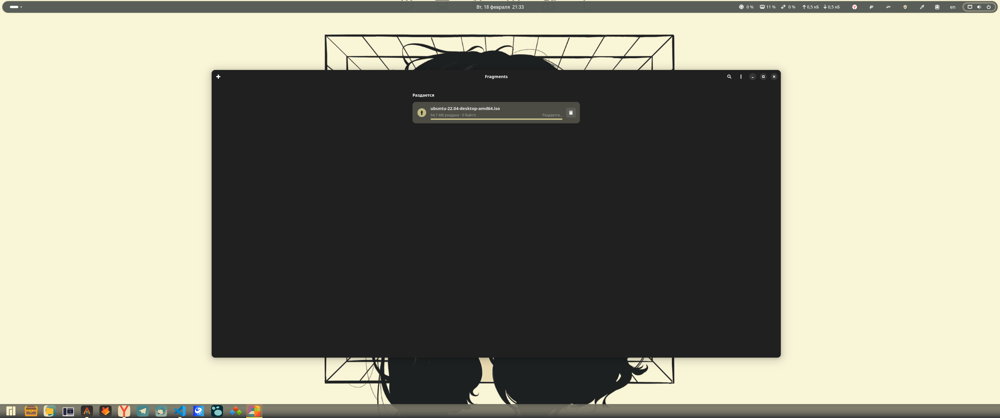
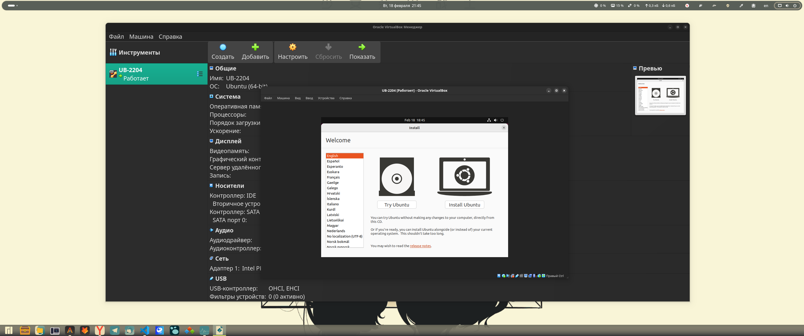
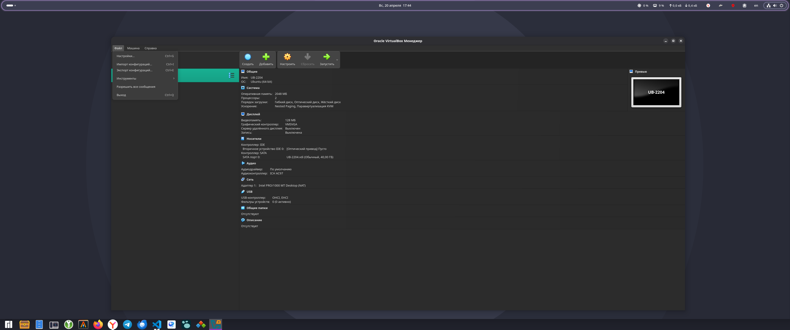

# Домашняя работа № 1

> Я использую Manjaro Linux на личном ПК, поэтому все задания будт выполнены на нем и скриншоты на нем. 
> У меня нет личного устройсва с ОС Windows.

## VirtualBox

### Включить аппаратную виртуализацию на компьютере/ноутбуке (если отключена).

На linux дистрибутивах за аппарутную виртуализацию отвечает KVM ([Kernel-based Virtual Machine](https://ru.wikipedia.org/wiki/KVM)). 

Для провеки выплним команду:

```bash

lsmod | grep kvm

```

И посмотрим на ее вывод


Данный вывод показывает состояние загруженных модулей ядра, связанных с аппаратной виртуализацией:

1. **kvm_amd (237568)**  
   - Драйвер для поддержки аппаратной виртуализации на процессорах AMD (SVM — Secure Virtual Machine).  
   - Размер модуля: 237568 байт.  
   - Используется 0 раз (последний ноль: нет активных зависимостей).

2. **kvm (1388544)**  
   - Основной модуль KVM (Kernel-based Virtual Machine).  
   - Размер: 1.38 МБ.  
   - Зависит от `kvm_amd` (цифра 1 в последнем столбце).

3. **ccp (184320)**  
   - Модуль **Crypto Co-Processor** — отвечает за работу с криптографическим сопроцессором AMD.  
   - Связан с `kvm_amd` (цифра 1 в последнем столбце).

---

Таким образом мы убедились, что загружены модули `kvm_amd` и `kvm`, что указывает на корректную работу KVM для моего процессора AMD. Значит аппаратная виртуализация активна.

### Скачать и установить VirtualBox версии 6.1 и выше

Для начала установим нужные заивсимти. Я испльзую менеждер пакетов `yay`. Поэтому команда будет выглядеть следующим образом.


После установим сам VirtualBox. 


Таже установим доплнительный пакет для гостевых ОС 


### Скачать и установить плагин VirtualBox Extension Pack: в отчете отобразить список функций, которые предоставляет Extension Pack.

Для установки выполним следющею команду:


После согласимся с установкой и укажем пароль для sudo. 

После установки проверим что версии VirtualBox и VirtualBox Extension Pack совпадают. Это важно для корректной работы. 


Видим, что версии сопадают. У обоих 7.1.6.

**Список функций, которые предоставляет Extension Pack**


1. **Поддержка USB 2.0/3.0**  
   Позволяет подключать физические USB-устройства (флешки, принтеры) внутри виртуальных машин.

2. **VirtualBox RDP (Remote Desktop Protocol)**  
   Удалённое управление виртуальными машинами через протокол RDP.

3. **Шифрование дисков**  
   Защита данных виртуальных HDD с помощью AES-256. Пример использования:  

4. **PXE Boot для Intel**  
   Сетевая загрузка виртуальных машин через эмуляцию PXE ROM.

5. **Общий доступ к веб-камере хоста**  
   Использование камеры физического устройства в гостевой ОС без драйверов.

**Дополнительные возможности**

- **NVMe-хранилище**  
  Эмуляция современных SSD для повышения производительности.
- **Виртуальное USB-устройство xHCI**  
  Поддержка USB 3.0 в гостевых ОС.
- **Cloud Integration**  
  Автоматическая интеграция с облачными сервисами через VRDE.
- **Шифрование VMCI**  
  Защита межмашинного взаимодействия.

Источники:  

- [Официальная документация](https://www.virtualbox.org/manual/ch01.html#intro-installing)  
- [Oracle VM VirtualBox Documentation](https://documentation.help/VirtualBox/ch08s41.html)

### Скачать десктопную версию Ubuntu 22.04 LTS (Jammy Jellyfish)

Скачать десктопную версию Ubuntu 22.04 LTS (Jammy Jellyfish), создать виртуальную машину со
следующими параметрами:

- 2 CPU.
- 2048 RAM.
- 128 МБ видеопамяти.
- 40 GB постоянной памяти (динамический VDI)
- Сетевой адаптер установить в режим NAT

Для скачивания перходим на оффицальный сайт [ubuntu](https://releases.ubuntu.mirror.onlime.sl/jammy/)


Я выбраз загрузку через торрент для большей скорости


Полсле ждем загружки



Теперь можно приступать к созданию витруальной машины в VirtualBox.


Нажимаем кнопку создать и даем название нашей машине и указываем путь до ISO обрза.
Прожимаем "Пропустить автоматическую установку" чтоб самим следовать по шагам установщика.


Далее указываем ресурсы для нашей виртуальной машине, согласно зданию


Наша виртуальная машина создалась.

При создании не было возможности указать количество видео памяти, поэтому зададим ее сейчас. 


И NAT


### Произвести установку ОС Ubuntu 22.04 LTS на виртуальную машину, следуя указаниям установщика

Для установки надо запустить виртуальную машину.


После запуска видим варианты запуска. Для установки выбираем первый пункт.


Видим графический установщик.



Далее идет по шагам которые предлагает графический утановщик Ubuntu.

Полсе всех шагов видим окно с информацией о завершении установки. 


Перезагружаем систему. После видим выбор пользователя для входы. Выбираем нашего пользователя и вводим пароль.


Пропускаем все приветвенные окна и видим, что все готово к работе. 


### Создать снимок виртуальной машины, назвать снимок именем «Ubuntu-clear»

Выключаем виртуальную машину. Полсе нажимаем на 3 черточки и выбираем раздел для создания сномков. 


Открывается следующее меню


Нажимаем кнопку "Сделать". Указываем имя и описвание снимка.


Видим созданый снимок.


### Произвести установку гостевых дополнений и перезагрузить виртуальную машину

Первым делом обновим все пакеты. 


Обновим систему.


Теперь установим зависимомти.


Для установки зависимостей гостевых дополнений VirtualBox в Ubuntu выполним

```bash
sudo apt update && sudo apt install -y build-essential dkms linux-headers-$(uname -r) gcc make perl module-assistant
```
Пояснение пакетов:
- `build-essential` — компиляторы и инструменты сборки
- `dkms` — динамическое обновление модулей ядра
- `linux-headers-$(uname -r)` — заголовки текущей версии ядра
- `gcc`, `make`, `perl` — базовые инструменты компиляции
- `module-assistant` — упрощает сборку сторонних модулей


После нужна подготовка окружения (для Ubuntu 22.04+)

```bash
sudo m-a prepare
```


После нажимаем "Устройства" -> "Подключить образ Дополнительной гостевой ОС"


Видим что появился значек диска, то есть примонтировался диск с гостевыми дополнениями 


Автоматическая установка не произошла, поэтому надо запустить установку вручную. Для этого надо перейти в смонтированый диск и найти скрипт для запуска установки.


Запускаем нужный скрипт


После зпуска видим сообще о успешной установке.


Перезагружаем виртуальную машину


После перезапуска получается растянуть виртуальную машину на весь экран, что говорит об успешной установке и корректной работе.


Источники:
- <https://bafista.ru/virtualbox-install-guest-additation-linux-ubuntu/>
- <https://blog.programs74.ru/how-to-install-virtualbox-guest-additions-on-ubuntu-2204/>
- <https://losst.pro/ustanovka-dopolnenij-gostevoj-os-ubuntu>

### Создать снимок виртуальной машины, назвать снимок именем «Ubuntu-guest-additions»


### Произвести настройку операционной системы в соответствии с личными предпочтениями (сменить обои, установить браузер и т.д)

Произвел кастомизацию. Установил:

* tmux
* neovim
* alacritty
* Яндекс браузер

Поменял фон и тему оформления


### Создать снимок виртуальной машины, назвать снимок именем «Ubuntu-customized»


### Произвести экспорт виртуальной машины в формате OVA.

В главном меню VirtualBox выбераем Файл 


Далее Экспорт конфигураций



Выбераем нашу виртуальную машину

 

Видим процесс экспорта


После выполнения можем найти файл в директории 


## Vagrant

