# Домашняя работа № 11

**Выполнил:** Груданов Николай Алексеевич

---


## Выполнение работы

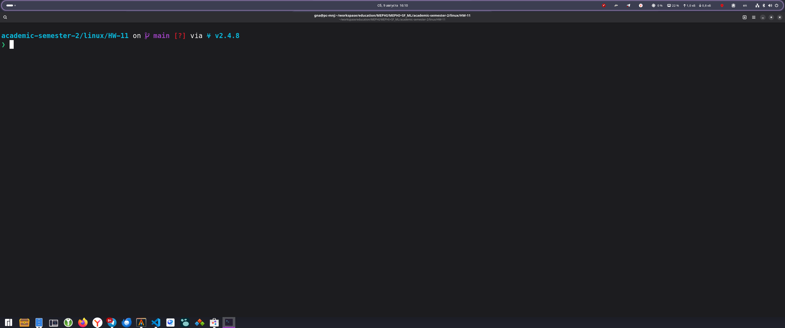

#### 1.1 Запуск всех виртуальных машин
```bash
vagrant up
```
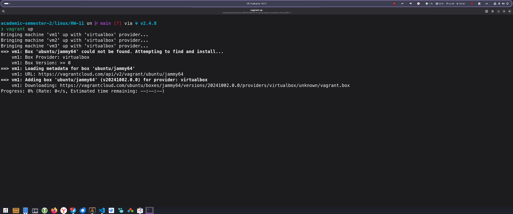

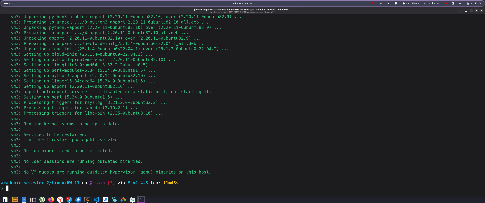

#### 1.2 Проверка статуса после запуска
```bash
vagrant status
```
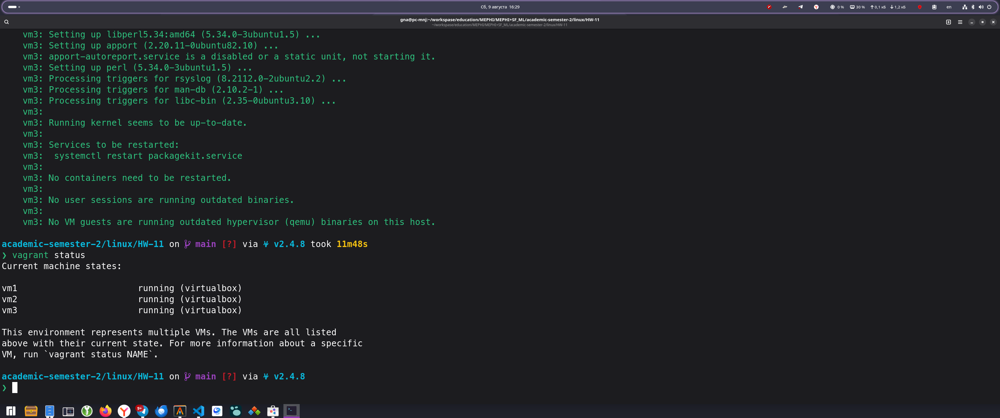

---

### 2. Проверка VM1

#### 2.1 Подключение к VM1 и проверка установленных пакетов

```bash
vagrant ssh vm1
```


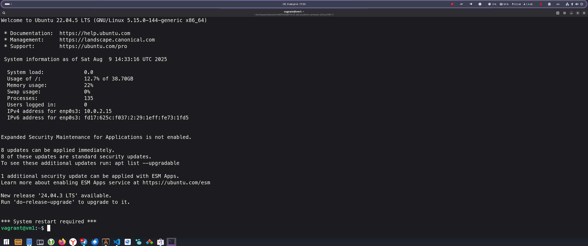

```bash
dpkg -l | grep ubuntu-desktop-minimal
which chromium-browser
snap list | grep store
```


#### 2.2 Проверка службы Xrdp

```bash
sudo systemctl status xrdp
```
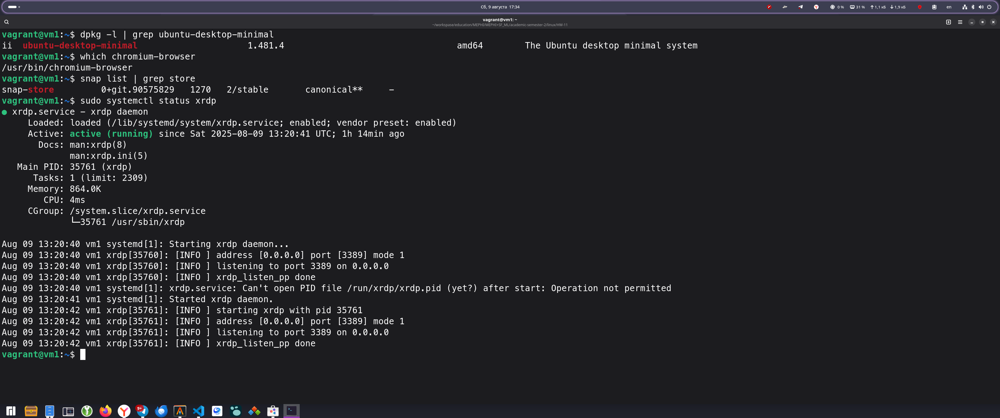

```bash
ss -tnlp | grep 3389
```
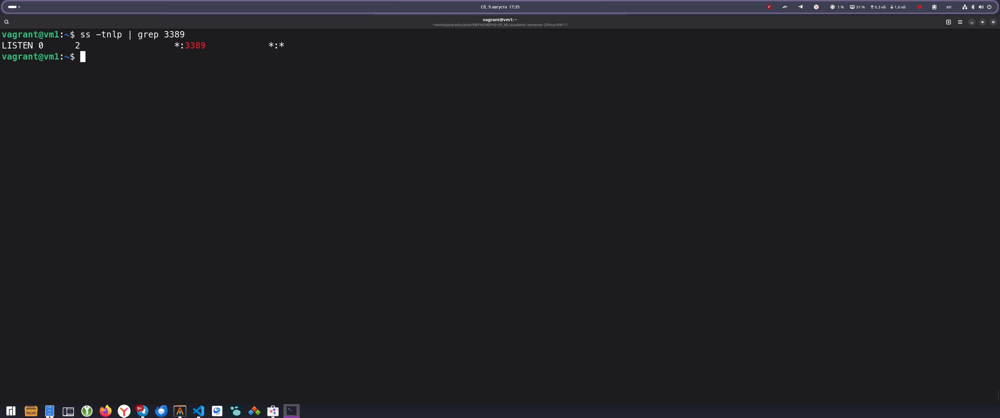


### 3. Проверка VM2 - Docker и WireGuard

#### 3.1 Подключение к VM2 и проверка Docker

```bash
vagrant ssh vm2
```
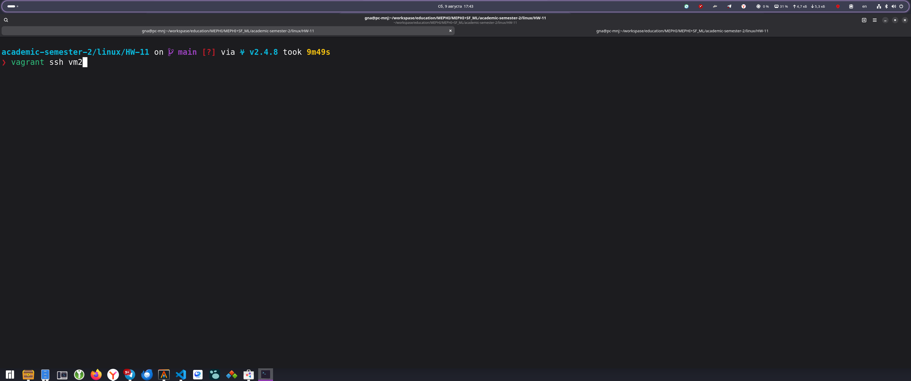

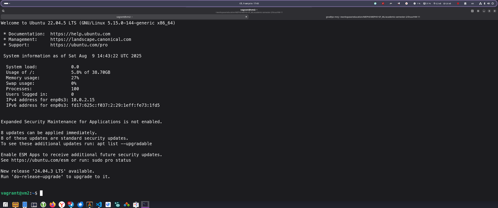

```bash
docker --version
sudo systemctl status docker
sudo systemctl status docker
```
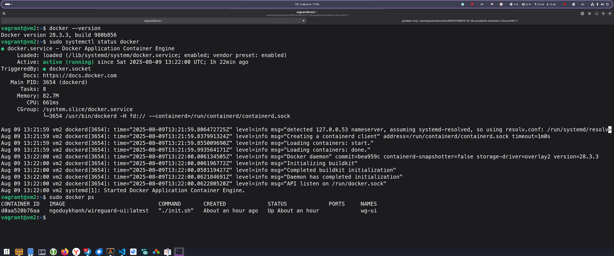

#### 3.2 Проверка WireGuard tools

```bash
which wg
wg --version
```
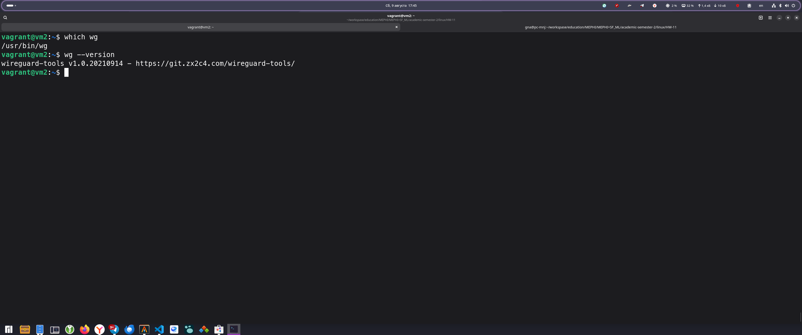


#### 3.3 Проверка WireGuard UI контейнера

```bash
docker ps | grep wg-ui
docker logs wg-ui
```
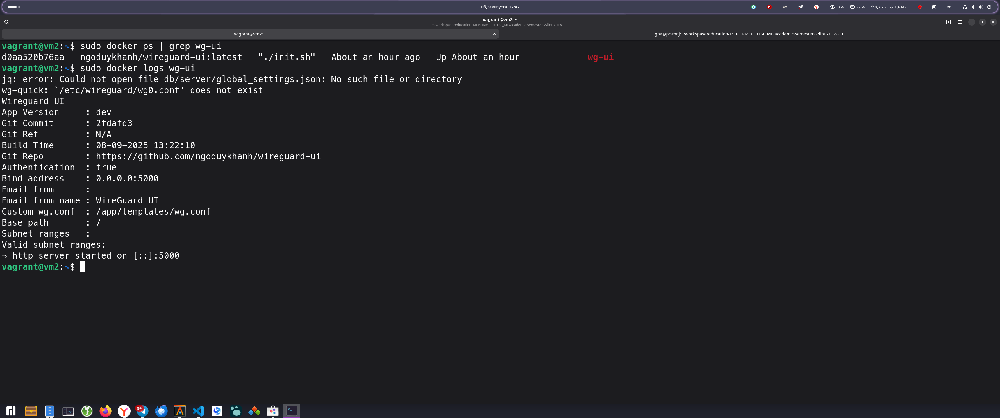

#### 3.4 Проверка доступа к WireGuard UI через браузер

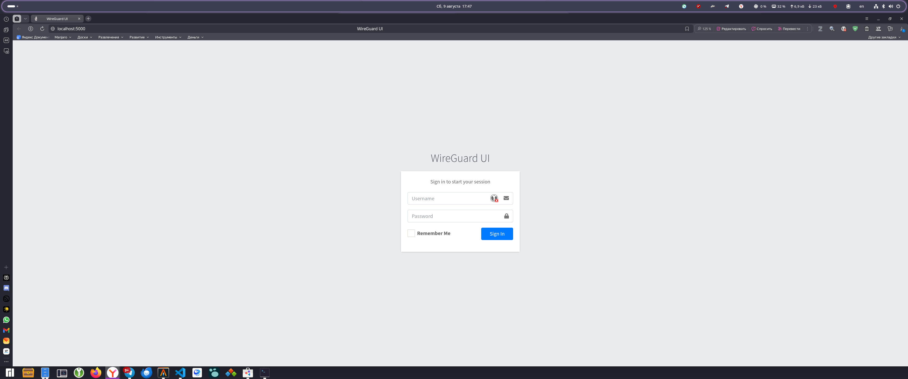

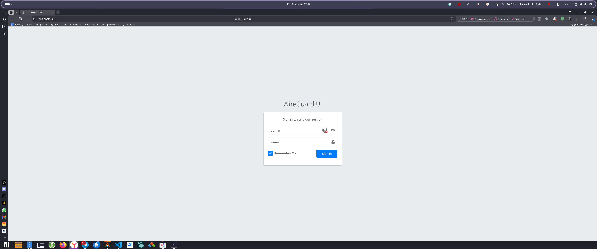

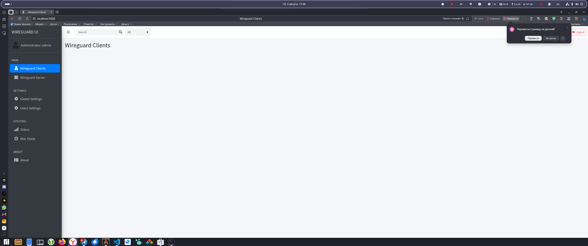

---

### 4. Проверка VM3 - Пользователь adam

#### 4.1 Подключение к VM3 и проверка пользователя adam

```bash
vagrant ssh vm3
```
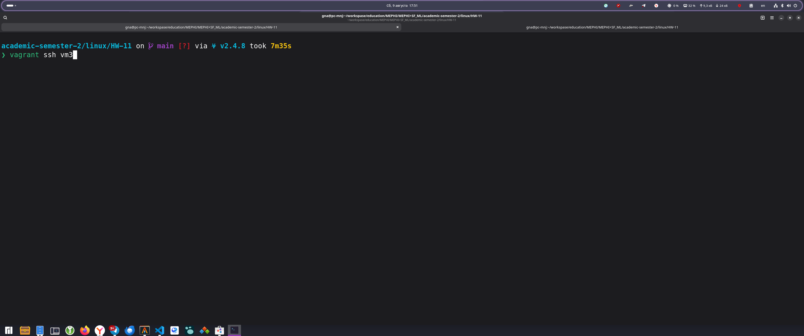

```bash
id adam
getent passwd adam
```

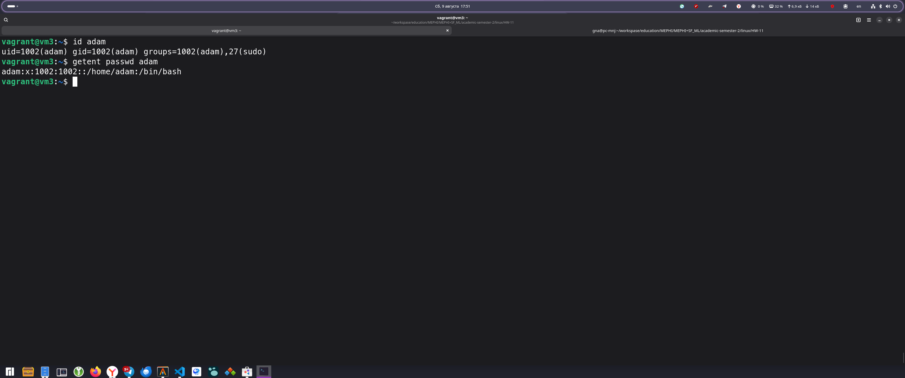

#### 4.2 Проверка домашней директории и оболочки

```bash
grep adam /etc/passwd
```
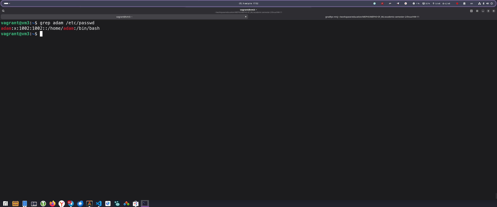

#### 4.3 Проверка первичной группы adam
```bash
groups adam
getent group adam
```
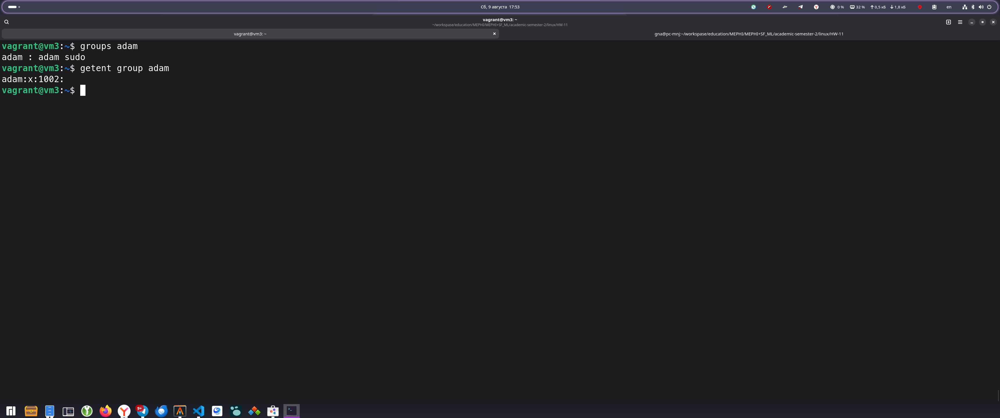

---


