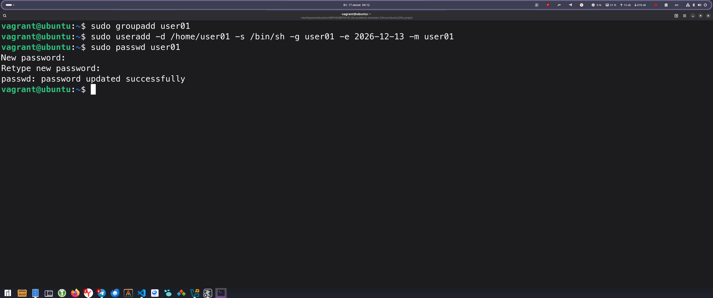
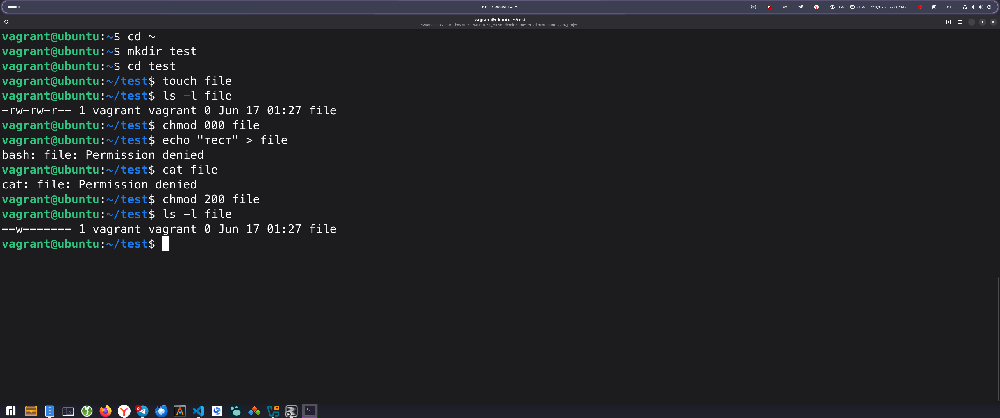

# Домашняя работа № 3

Выполнил: Груданов Николай Алексеевич

## Подготовка к выполнению

### 1. Запуск записи сеанса

Перед началом выполнения заданий запустим команду для записи сеанса:

```bash
script typescript.txt
```


## Часть 1: Управление пользователями и группами

### Задание 1: Переход в домашний каталог

```bash
cd ~
```


### Задание 2: Определение бюджета пользователя vagrant

```bash
cat /etc/passwd | grep vagrant
```


### Задание 3: Определение минимального возраста пароля

```bash
sudo cat /etc/shadow | grep vagrant
```


### Задание 4: Дата последнего изменения пароля

```bash
sudo passwd -S vagrant
```


### Задание 5: Создание пользователя user01

Созданим сначала группу 

```bash
sudo groupadd user01
```
После добавим туда нового пользователя

```bash
sudo useradd -d /home/user01 -s /bin/sh -g user01 -e 2026-12-13 -m user01
```


### Задание 6: Установка пароля пользователю user01
```bash
sudo passwd user01
```


### Задание 7: Вход под учетной записью user01

```bash
su user01
```

Введем пароль, который мы установили на предыдущем шаге.


### Задание 8: Проверка текущего пользователя
```bash
whoami
```


### Задание 9: Переход в домашний каталог и проверка содержимого
```bash
cd ~
pwd
ls -la
```


### Задание 10: Установка информации о пользователе
```bash
chfn
```
Команда запросит ввод полного имени, номера комнаты, рабочего и домашнего телефонов.


### Задание 11: Просмотр информации о пользователе
```bash
finger user01
```


### Задание 12: Выход из сеанса user01
```bash
exit
```


### Задание 13: Добавление user01 в группу sudo
```bash
sudo usermod -a -G sudo user01
```


### Задание 14: Повторный вход от имени user01
```bash
su user01
```


### Задание 15: Проверка прав sudo
```bash
sudo whoami
```


Вывело `root`, значит права sudo предоставлены корректно.

### Задание 16: Создание группы group01

```bash
sudo groupadd group01
```


### Задание 17: Добавление пользователей в группу group01

```bash
sudo usermod -a -G group01 user01
sudo usermod -a -G group01 vagrant
```


### Задание 18: Проверка членов группы

```bash
sudo groupmems -g group01 -l
```


### Задание 19: Выход из сеанса user01
```bash
exit
```

## Часть 2: Управление доступом к файлам и каталогам

### Задание 1: Переход в домашний каталог
```bash
cd ~
```


### Задание 2: Создание каталога test
```bash
mkdir test
cd test
```


### Задание 3: Создание файла и проверка прав
```bash
touch file
ls -l file
```


### Задание 4: Запрет всех действий с файлом
```bash
chmod 000 file
```


### Задание 5: Попытка записи в файл
```bash
echo "тест" > file
```


Видем ошибку "Permission denied".

### Задание 6: Попытка чтения файла
```bash
cat file
```


Видем ошибку "Permission denied".

### Задание 7: Установка прав только на запись для владельца
```bash
chmod 200 file
```


Видем `--w-------`, значит все применилось успешно

### Задание 8: Запись в файл и попытка чтения
```bash
echo "test" > file
```


```bash
cat file
```


Запись успешно, чтение -  ошибка.

### Задание 9: Разрешение чтения для группы

```bash
chmod 240 file
```


Видем `--w-r-----`, значит все применилось успешно

### Задание 10: Попытка чтения файла
```bash
cat file
```


Все еще   ошибка, так как у владельца нет права чтения.

### Задание 11: Разрешение чтения владельцу
```bash
chmod 640 file
```


### Задание 12: Чтение содержимого файла
```bash
cat file
```


### Задание 13: Создание каталога и файла в нем
```bash
mkdir dir
echo "file 2" > dir/new_file
```


### Задание 14: Просмотр содержимого каталога
```bash
ls -l dir
```


### Задание 15: Изменение прав каталога
```bash
chmod -x dir
cat dir/new_file
rm dir/new_file
```


Обе операции выдали ошибку "Permission denied".

### Задание 16: Попытка изменения владельца
```bash
chown root file
chgrp root file
```


Обе команды выдали ошибку, так как обычный пользователь не может изменить владельца.

### Задание 17: Установка umask для создания приватных файлов
```bash
umask 077
touch file1
ls -l file1
```


### Задание 18: Установка umask для полного доступа
```bash
umask 000
touch file2
ls -l file2
```


Права  `-rw-rw-rw-`

### Задание 19: Вход как root
```bash
sudo su
```


### Задание 20: Изменение владельца от имени root
```bash
chown root file
chmod 400 file
exit
```


### Задание 21: Попытка чтения файла обычным пользователем
```bash
cat file
```


### Задание 22: Предоставление прав группе от имени root
```bash
sudo su
chmod 440 file
exit
```


### Задание 23: Чтение файла обычным пользователем
```bash
cat file
```


## Создание итогового файла dz3.txt


```bash
cat /etc/passwd >> dz3.txt
cat /etc/group >> dz3.txt
```


## Завершение работы

```bash
exit
```

