# Домашняя работа № 6

Выполнил: Груданов Николай Алексеевич

---

Изучение свойств блочных устройств

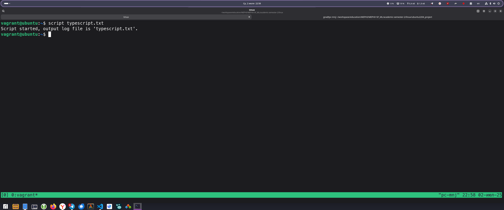

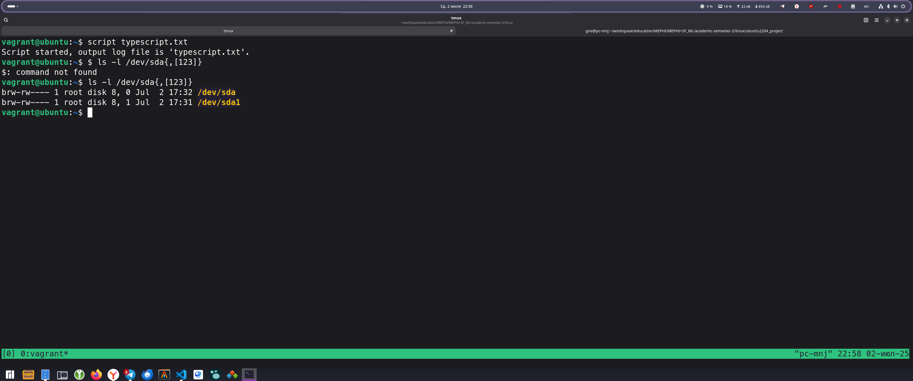

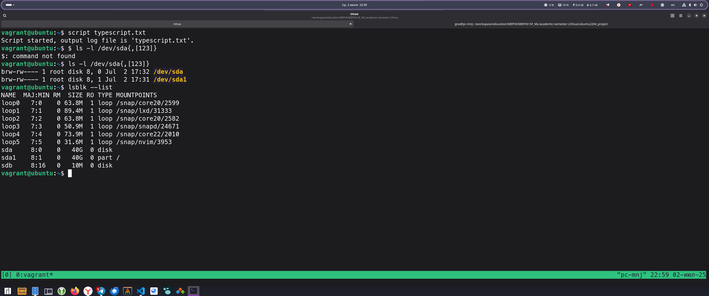

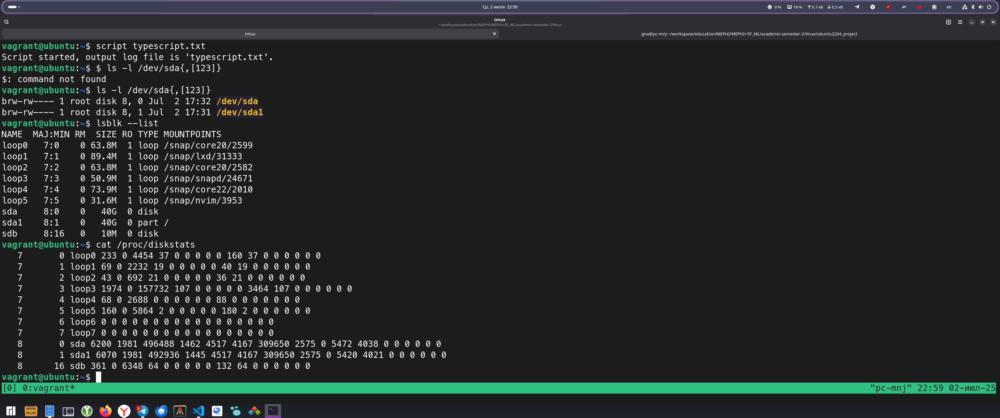

Создание файла-образа

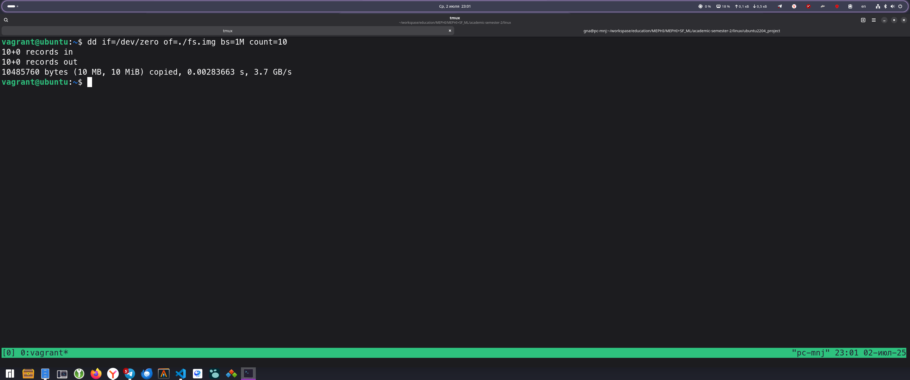

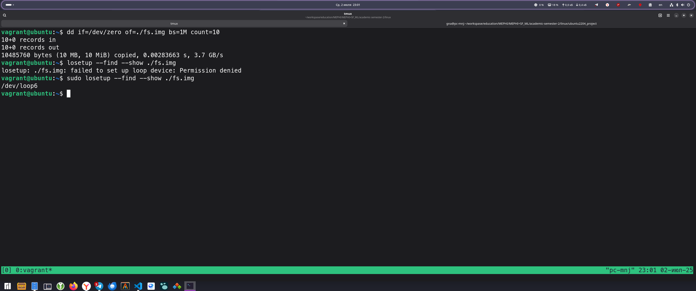

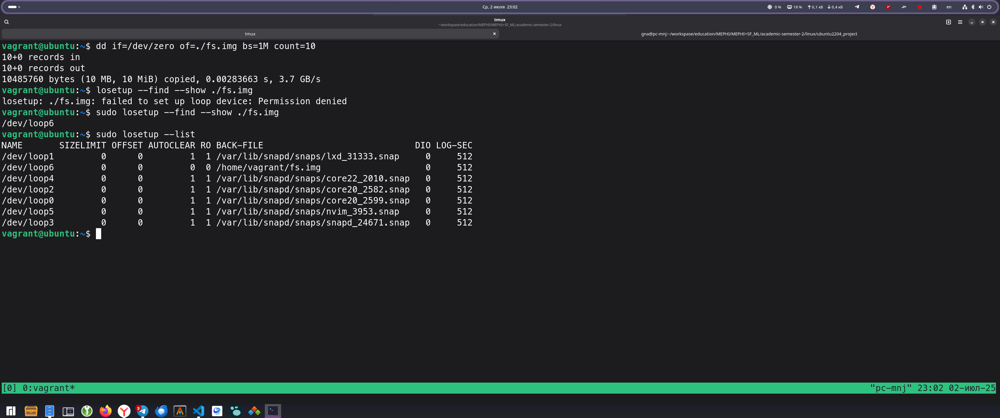

Создание файловой системы ext4

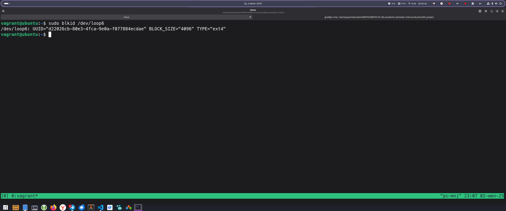

Монтирование файловой системы

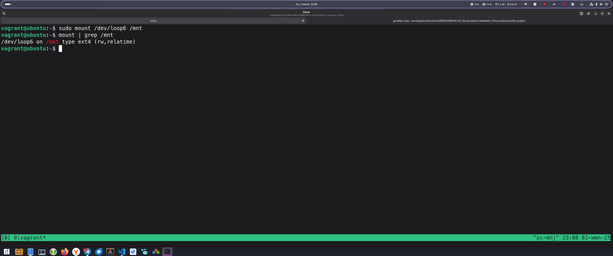

Мониторинг файловой системы

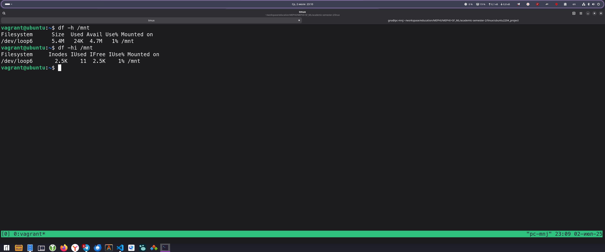

Размонтирование

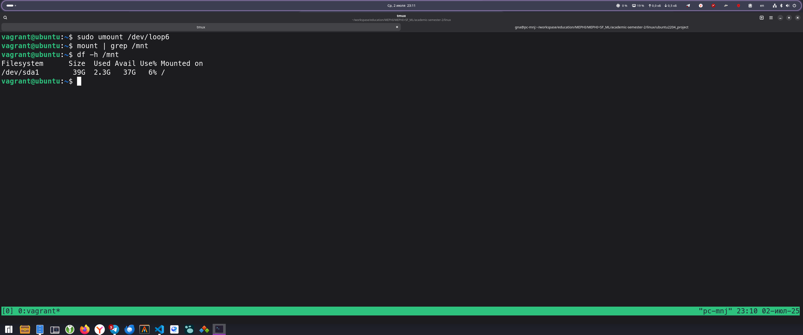

Исследование свойств файловой системы

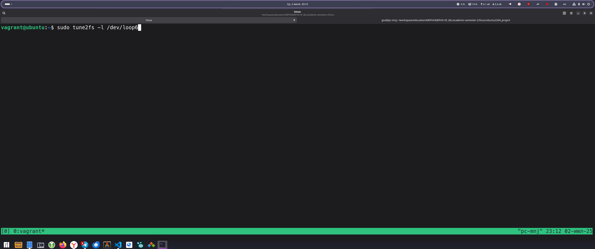

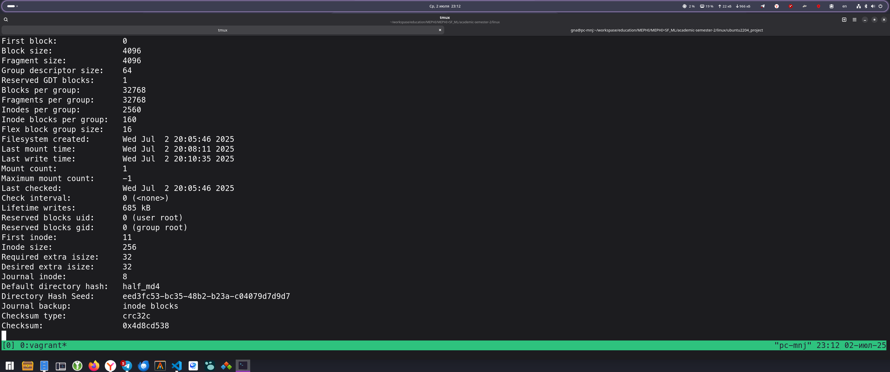

Освобождение loop-устройства

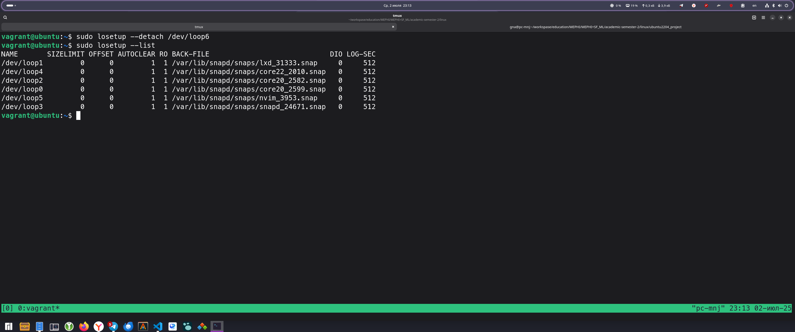

