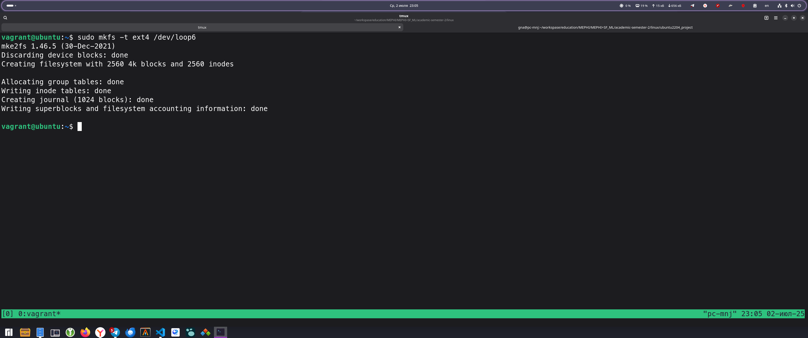

# Домашняя работа № 6

Выполнил: Груданов Николай Алексеевич

---

Изучение свойств блочных устройств

Создание файла-образа

Создание файловой системы ext4

Монтирование файловой системы

Мониторинг файловой системы

Размонтирование

Исследование свойств файловой системы

Освобождение loop-устройства

