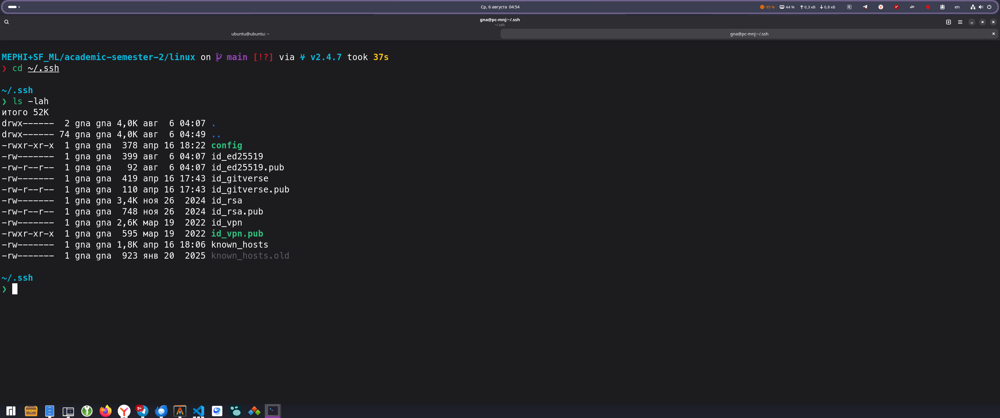

# Домашняя работа № 8

Выполнил: Груданов Николай Алексеевич

---

## Запуск записи сессии

```bash
script typescript.txt
```


## Выполнение базовых команд

### 1. Проверка DNS сервера Google

```bash
ping 8.8.8.8
```


### 2. Трассировка маршрута

```bash
traceroute 8.8.4.4
```


### 3. Определение сетевого адреса VM

```bash
ip a
```


### 4. MX-запись домена

```bash
nslookup -type=MX google.com
```


### 5. Сканирование портов

```bash
nmap -p22,80,443 localhost
```


### 6. Запрос DNS информации

```bash
dig @8.8.8.8 google.com
```


### 7. Захват сетевого трафика

```bash
sudo tcpdump > tcp.dump
```


## Настройка SSH

### 1. Проверка службы SSH

```bash
sudo systemctl is-active ssh
```


### 2. Создание SSH ключей

```bash
ssh-keygen
```


### 4. Настройка пользователя ubuntu

```bash
sudo su - ubuntu
mkdir -p ~/.ssh
vim ~/.ssh/authorized_keys
```


Выполняем на хосте




Скопируем весь вывод команды `cat ~/.ssh/id_ed25519.pub` и вставим в файл `authorized_keys` на виртуальной машине


### 5. Настройка прав доступа

```bash
chmod 700 ~/.ssh
chmod 600 ~/.ssh/authorized_keys
```


### 6. Создание резервной копии конфигурации

```bash
sudo cp /etc/ssh/sshd_config /etc/ssh/sshd_config.backup
```


### 7. Редактирование конфигурации SSH

```bash
sudo vim /etc/ssh/sshd_config
```


### 8. Перезапуск службы SSH

```bash
sudo systemctl restart ssh
```


### 9. Выход из VM

```bash
exit
```


### 10. Тестирование подключения с хоста с использованием ключа
```cmd
ssh -p 2222 -i ~/.ssh/id_ed25519 ubuntu@127.0.0.1
```


